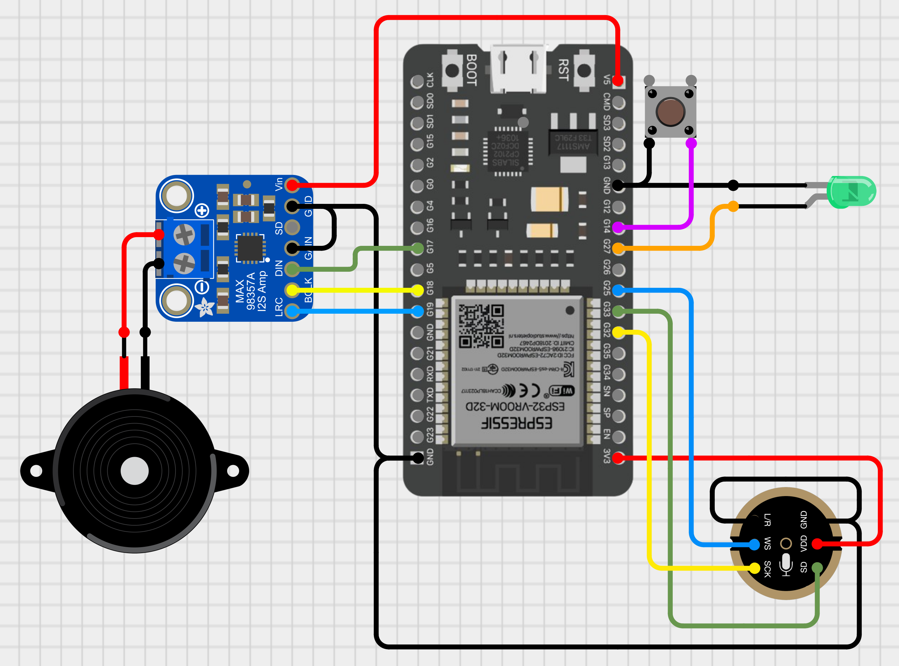

# AI Assistant

This project demonstrates how to create an AI Assistant using the INMP441 microphone with an ESP32 microcontroller for speech-to-text functionality using [Google's Speech-to-Text API](https://cloud.google.com/speech-to-text) and the MAX98357A amplifier module within the Arduino IDE. Pressing the pushbutton triggers the ESP32 to record audio for a predetermined duration. An LED visually indicates the recording process. The recorded audio is encoded using 16-bit linear pulse-code modulation (PCM) and securely transmitted to Google's server via a web socket established through [WiFiClientSecure](https://github.com/espressif/arduino-esp32/tree/master/libraries/WiFiClientSecure). The resulting speech-to-text transcription is sent to the ChatGPT REST API. The response from ChatGPT is play in a speaker.

## Google's Speech-to-Text API Key

Before jumping into coding get an API Key in order to use [Google's Speech-to-Text API](https://cloud.google.com/speech-to-text). To setup up an API Key follow [these steps](https://support.google.com/googleapi/answer/6158862). Replace your API Key in the Sketch:

Before diving into coding, you'll need an API key from [Google's Speech-to-Text](https://cloud.google.com/speech-to-text) service. Here's how to obtain and set it up:

1. Visit the [Google Cloud Platform Console](https://console.cloud.google.com/)
2. Create a new project or select an existing one.
3. Enable the Google Cloud Speech-to-Text API for your project.
4. Go to the "APIs & Services" section and click on "Credentials".
5. Click on "Create credentials" and select "API key".
6. Copy the generated API key and paste it into the designated field replacing the placeholder.

```c++
const char* googleApiKey = "<YOUR_API_KEY>";
```

Remember to keep your API key secure and avoid sharing it publicly. To read more about [Setting up API keys](https://support.google.com/googleapi/answer/6158862) go [here](https://support.google.com/googleapi/answer/6158862).

This project leverages the [speech:recognize API](https://cloud.google.com/speech-to-text/docs/reference/rest/v1/speech/recognize) as detailed in [Transcribe short audio files](https://cloud.google.com/speech-to-text/docs/sync-recognize). This enables the ESP32 to process user speech in real-time for interactive voice commands.

Following the recommendations outlined in [Best practices to provide data to the Speech-to-Text API](https://cloud.google.com/speech-to-text/docs/best-practices-provide-speech-data), the audio in this project is sampled at `16,000 Hz` and encoded using 16-bit linear pulse-code modulation (PCM) in the `LINEAR16` format.

For detailed information on audio encoding for Speech-to-Text, refer to these resources: 

* [Introduction to audio encoding for Speech-to-Text ](https://cloud.google.com/speech-to-text/docs/encoding)
* [WAVE PCM soundfile format](http://soundfile.sapp.org/doc/WaveFormat/)

## OpenAI API Key

In order to get responses from [ChatGPT](https://chat.openai.com) you need to create an OpenAI account or sign in. Next, navigate to the API key page and "Create new secret key", optionally naming the key. Make sure to save this somewhere safe and do not share it publicly. Copy the generated API key and paste it into the designated field replacing the placeholder.

```c++
const char* chatGPTApiKey = "<YOUR_API_KEY>";
```

Ths project leverages the [Chat Completion API](https://platform.openai.com/docs/api-reference/chat). For details information on the API refer to [Chat Completions API guide](https://platform.openai.com/docs/guides/text-generation/chat-completions-api).

## Recording duration

The ESP32 will record audio for a predetermined duration. The duration is passed as an argument when calling the `Transcribe()` method.

```c++
STTController* controller = new STTController(...);

int duration = 5;  // Duration in seconds
String stt = controller->Transcribe(duration);
```

## Wiring up

This project uses the [ESP32-audioI2S library](https://github.com/schreibfaul1/ESP32-audioI2S) which only works on multi-core ESP32 chips like the ESP32-WROOM-32 or ESP32-S3. It does not work on the ESP32-S2 or the ESP32-C3.

Modify the wiring as needed.

<div align="center">

</div>

```c++
#define PIN_LED 27
#define PIN_PUSH_BUTTON 14

#define I2S_MIC_SCK 32
#define I2S_MIC_WS 25
#define I2S_MIC_SD 33

#define I2S_DIN 17
#define I2S_BCLK 18
#define I2S_LRC 19
```


|INMP441 | ESP32| Info|
|---|---|---|
|VDD|3v3|Power - DO NOT USE 5V!|
|GND|GND|GND|
|L/R|GND|Left channel or right channel|
|WS|25|Left right clock|
|SCK|32|Serial clock|
|SD|33|Serial data|

|MAX98357A | ESP32| Info|
|---|---|---|
|Vin|5v|Power - 3 to 6 VDC|
|GND|GND|GND|
|SD|--|Left or right Output Select. NOT CONNECTED.|
|GAIN|GND|Or use resistor to set value|
|DIN|17|Serial data|
|BCLK|18|Serial clock|
|LRC|19|Left right clock|

## References

- [I2S - API Reference](https://docs.espressif.com/projects/esp-idf/en/v3.3.5/api-reference/peripherals/i2s.html)
- [Sound with ESP32 – I2S Protocol by DroneBot Workshop](https://dronebotworkshop.com/esp32-i2s/)
- [Project: The Simplest Test Code for an I2S Microphone on the ESP32 I can Imagine by atomic14](https://github.com/atomic14/esp32-i2s-mic-test/tree/main)
- [YouTube video: Speech To Text using ESP32 by techiesms](https://www.youtube.com/watch?v=VoanFTpCTU4)
- [Project: ESP32-ChatGPT by techiesms](https://github.com/techiesms/ESP32-ChatGPT/tree/main/Speech_To_Text_ESP32)
- [Project: esp32_CloudSpeech by MhageGH](https://github.com/MhageGH/esp32_CloudSpeech)
- [Project: ESP32_INMP441_SPEECH_TO_TEXT by ThatProject](https://github.com/0015/ThatProject/tree/master/ESP32_MICROPHONE/ESP32_INMP441_SPEECH_TO_TEXT)
- [ESP32-audioI2S library](https://github.com/schreibfaul1/ESP32-audioI2S)
- [Cirkit Designer](https://zenluo.notion.site/Cirkit-Designer-Tutorials-4f5a47656b384709838eb5350596bf95)
