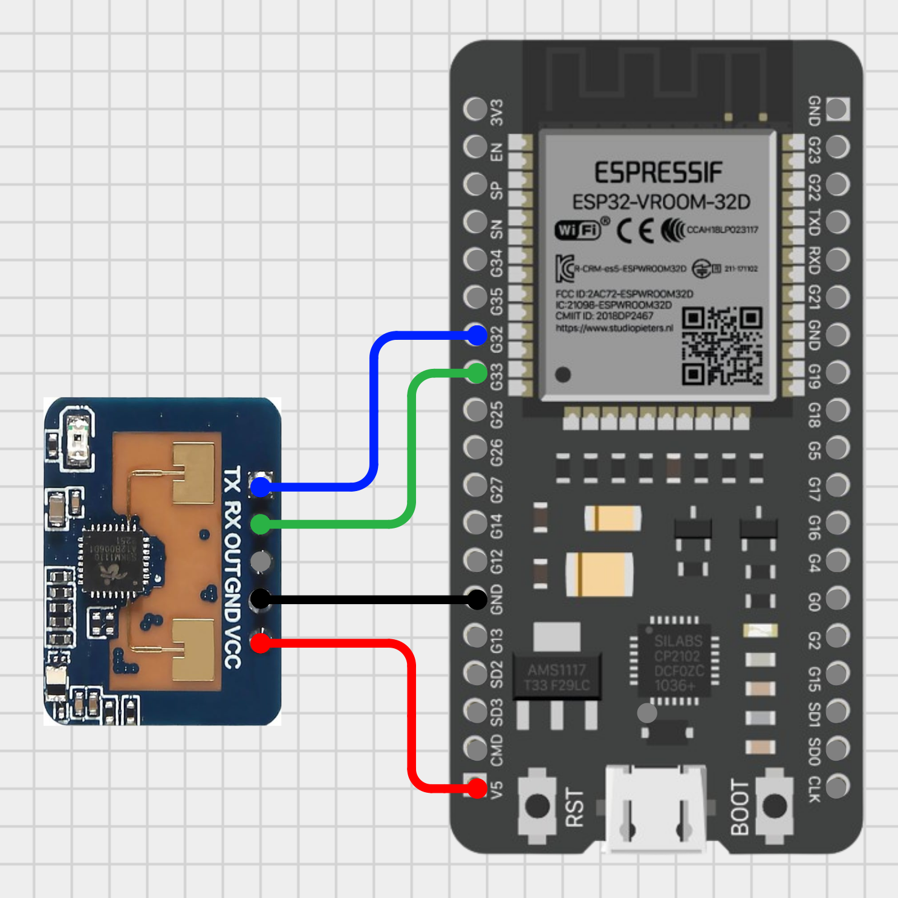

# Homekit Human Presence Sensor

This project demostrate how to build an Apple Homekit compatible Human Presence Sensor using an ESP32, a LD2410 Human Presence Radar Sensor Module and the [HomeSpan library](https://github.com/HomeSpan/HomeSpan).

The LD2410 Human Presence Radar Sensor Module has three available versions, although the core functionality is the same. This project uses the LD2410C model, but the sketch and wiring diagram bellow can be used for any of the LD2410 models. Here’s the main differences between:

|LD2410|LD2410B|LD2410C|
|---|---|---|
|No Bluetooth|Has Bluetooth|Has Bluetooth|
|1.27mm pins|1.27mm pins|2.54mm pins (standard)|

## Wiring up

Modify the wiring as needed.

<div align="center">

</div>

```c++
#define GPIO_RX_PIN 32  // Connect this GPIO pin to TX in the LD2410 module
#define GPIO_TX_PIN 33  // Connect this GPIO pin to RX in the LD2410 module
```

|LD2410| ESP32| Info|
|---|---|---|
|VCC|5V|Power|
|GND|GND|GND|
|OUT|Not connected|Not used|
|RX|33|RX from the LD2410 goes to TX in the ESP32|
|TX|32|TX from the LD2410 goes to RX in the ESP32|

## References

- [HomeSpan library](https://github.com/HomeSpan/HomeSpan)

- [LD2410 Human Presence Body Induction Distance Detection Radar Sensor Module](https://www.hlktech.net/index.php?id=988)
- [Official Datasheet and user manuals](https://drive.google.com/drive/folders/1p4dhbEJA3YubyIjIIC7wwVsSo8x29Fq-)
- [Arduino library for LD2410](https://github.com/ncmreynolds/ld2410)
- [DIY Presence Sensor With Hi-Link LD2410 And ESP32 For Home Assistant](https://smarthomescene.com/diy/diy-presence-sensor-with-hi-link-ld2410-and-esp32-for-home-assistant/)
- [Cirkit Designer](https://zenluo.notion.site/Cirkit-Designer-Tutorials-4f5a47656b384709838eb5350596bf95)
