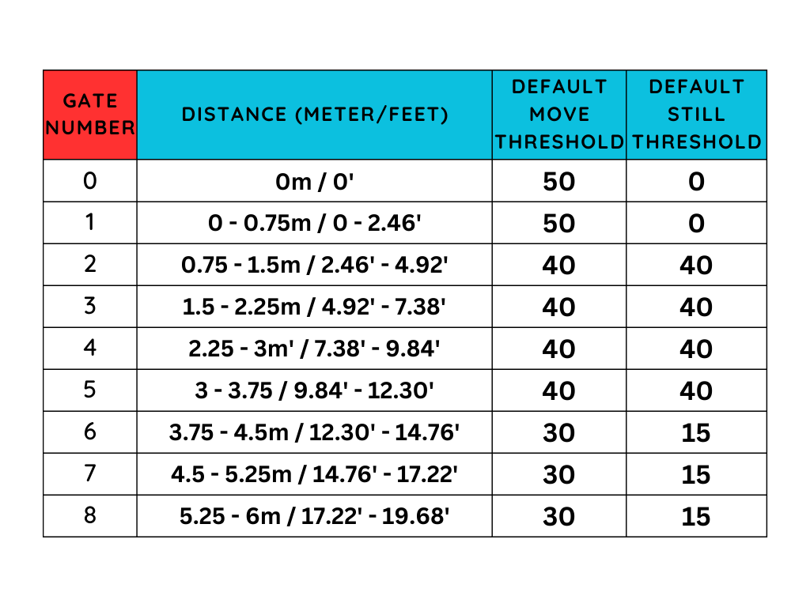
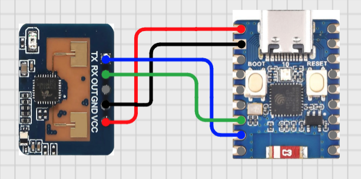
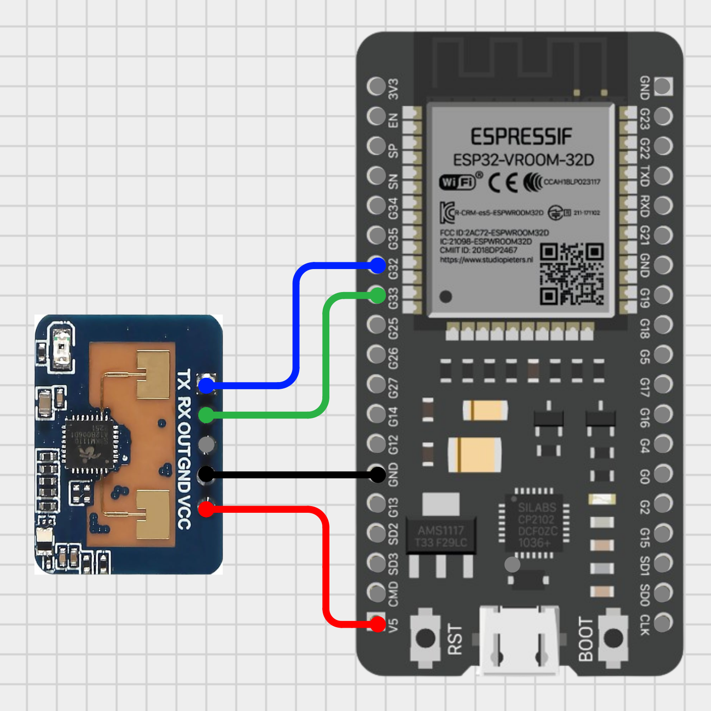

# Human Presence Sensor + Web Server + Homebridge integration

This project demostrate how to build a Human Presence Sensor Web Server using an ESP32 and LD2410 Human Presence Radar Sensor Module.

The LD2410 Human Presence Radar Sensor Module has three available versions, although the core functionality is the same. This project uses the LD2410C model, but the sketch and wiring diagram bellow can be used for any of the LD2410 models. Here’s the main differences between:

|LD2410|LD2410B|LD2410C|
|---|---|---|
|No Bluetooth|Has Bluetooth|Has Bluetooth|
|1.27mm pins|1.27mm pins|2.54mm pins (standard)|

<div align="center">

</div>

## Wiring up

Modify the wiring as needed.

Using an ESP32-C3-Zero

<div align="center">

</div>

Using an ESP32-VROOM-32D

<div align="center">

</div>

```c++
// for ESP32-C3-Zero
#define GPIO_RX_PIN 4  // Connect this GPIO pin to TX in the LD2410 module
#define GPIO_TX_PIN 3  // Connect this GPIO pin to RX in the LD2410 module

// for ESP32-VROOM-32D
#define GPIO_RX_PIN 32  // Connect this GPIO pin to TX in the LD2410 module
#define GPIO_TX_PIN 33  // Connect this GPIO pin to RX in the LD2410 module
```

|LD2410| ESP32| Info|
|---|---|---|
|VCC|5V|Power|
|GND|GND|GND|
|OUT|Not connected|Not used|
|RX|3 (33)|RX from the LD2410 goes to TX in the ESP32|
|TX|4 (32)|TX from the LD2410 goes to RX in the ESP32|

## Web server

Open thhe serial monitor. The sketch will print the IP of the ESP32. Copy and paste in a browser to see the web home page.

## Homebridge integration

This sketch can be use in combination with [Homebridge](https://homebridge.io/) and [HTTP Advanced Accessory plugin](https://github.com/staromeste/homebridge-http-advanced-accessory) to integrate your sensor to Homekit if you already have a bridge running Homebridge.

Here is an example configuration:

```json
{
    "accessory": "HttpAdvancedAccessory",
    "service": "OccupancySensor",
    "name": "Office Occupancy HTPP Sensor",
    "polling": true,
    "forceRefreshDelay": 1,
    "urls": {
        "getOccupancyDetected": {
            "url": "http://<IP-of-the-ESP32>/readings",
            "mappers": [
                {
                    "type": "jpath",
                    "parameters": {
                        "jpath": "$.presenceDetected"
                    }
                }
            ]
        }
    }
}

```

## References

- [ESP32 Plot Sensor Readings in Charts (Multiple Series)](https://randomnerdtutorials.com/esp32-plot-readings-charts-multiple/)
- [ESP32 Web Server using Server-Sent Events (Update Sensor Readings Automatically)](https://randomnerdtutorials.com/esp32-web-server-sent-events-sse/)
- [LD2410 Human Presence Body Induction Distance Detection Radar Sensor Module](https://www.hlktech.net/index.php?id=988)
- [Official Datasheet and user manuals](https://drive.google.com/drive/folders/1p4dhbEJA3YubyIjIIC7wwVsSo8x29Fq-)
- [Arduino library for LD2410](https://github.com/ncmreynolds/ld2410)
- [ESP32-C3 Mini Development Board by Waveshare](https://www.waveshare.com/esp32-c3-zero.htm)
- [ESP32-C3-Zero Wiki by Waveshare](https://www.waveshare.com/wiki/ESP32-C3-Zero)
- [ESP32 Chip Series Comparison](https://docs.espressif.com/projects/esp-idf/en/v4.3/esp32c3/hw-reference/chip-series-comparison.html)
- [Cirkit Designer](https://zenluo.notion.site/Cirkit-Designer-Tutorials-4f5a47656b384709838eb5350596bf95)
