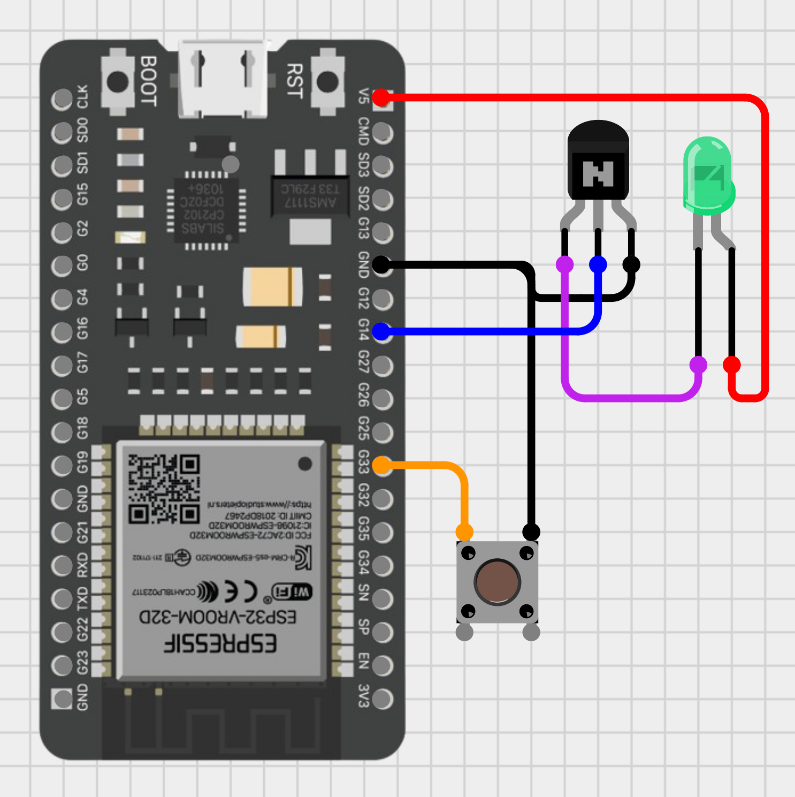

# Reading LED Light

This project uses an ESP32 and a push button to control an LED light (bedside lamp aka reading light) and connects to Apple HomeKit using [HomeSpan linrary](https://github.com/HomeSpan/HomeSpan).

## Wiring up

Modify the wiring as needed.

<div align="center">

</div>

```c++
int LED_PIN = 14;
int PUSH_BUTTON_PIN = 33;
```

## References

- [HomeSpan linrary](https://github.com/HomeSpan/HomeSpan)
- [Introduction to PN2222](https://www.theengineeringprojects.com/2019/06/introduction-to-pn2222.html)
- [Cirkit Designer](https://zenluo.notion.site/Cirkit-Designer-Tutorials-4f5a47656b384709838eb5350596bf95)
