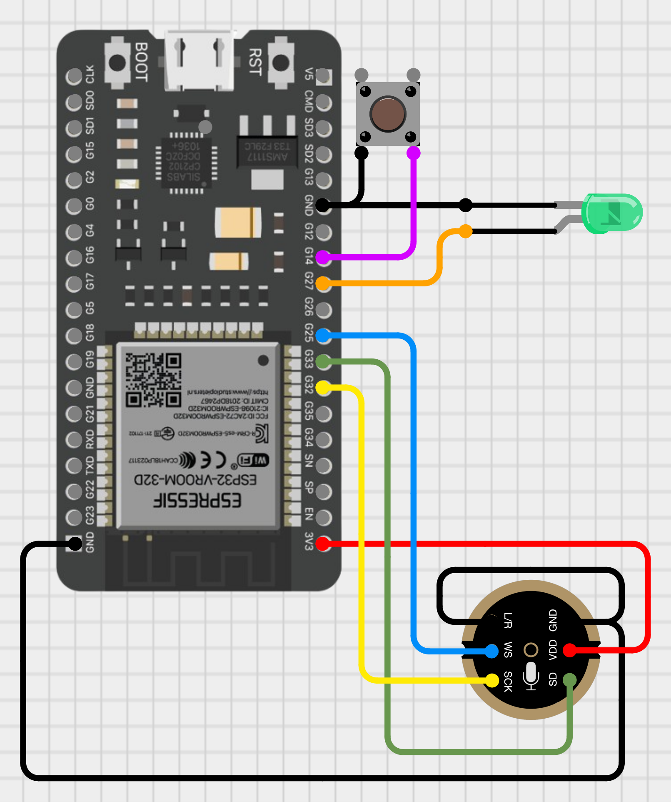
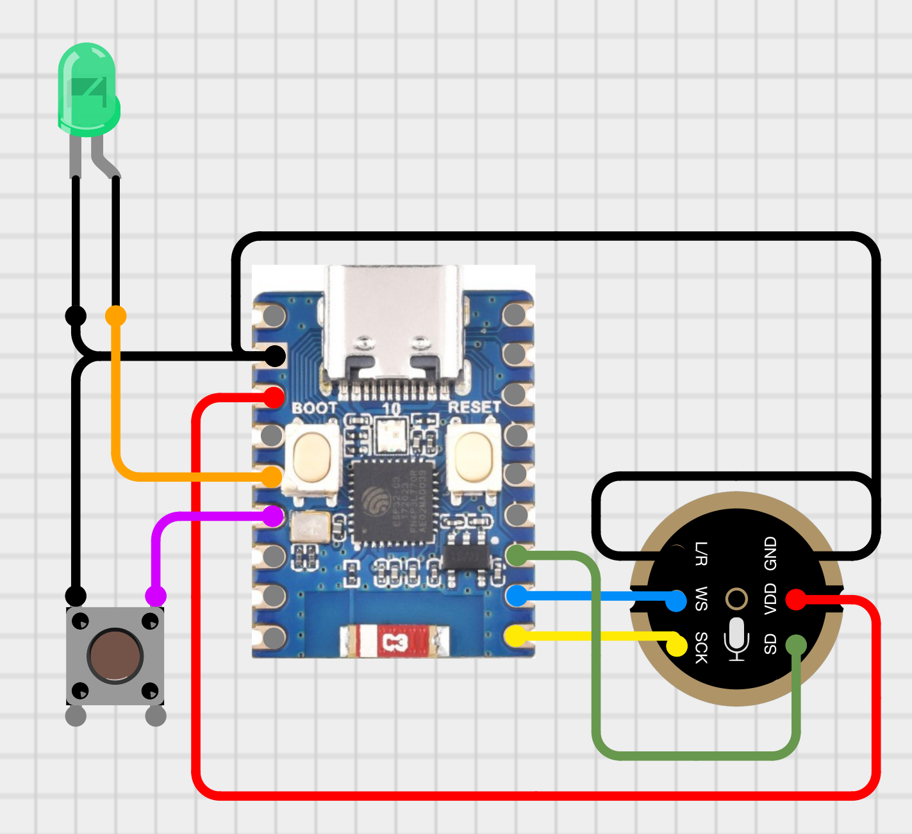

# SPEECH TO TEXT

This project demonstrates how to use the INMP441 microphone with an ESP32 microcontroller for speech-to-text functionality using [Google's Speech-to-Text API](https://cloud.google.com/speech-to-text) within the Arduino IDE. Pressing the pushbutton triggers the ESP32 to record audio for a predetermined duration. An LED visually indicates the recording process. The recorded audio is encoded using 16-bit linear pulse-code modulation (PCM) and securely transmitted to Google's server via a web socket established through [WiFiClientSecure](https://github.com/espressif/arduino-esp32/tree/master/libraries/WiFiClientSecure). The resulting speech-to-text transcription is then displayed in the Serial Monitor.

## Google's Speech-to-Text API Key

Before jumping into coding get an API Key in order to use [Google's Speech-to-Text API](https://cloud.google.com/speech-to-text). To setup up an API Key follow [these steps](https://support.google.com/googleapi/answer/6158862). Replace your API Key in the Sketch:

Before diving into coding, you'll need an API key from [Google's Speech-to-Text](https://cloud.google.com/speech-to-text) service. Here's how to obtain and set it up:

1. Visit the [Google Cloud Platform Console](https://console.cloud.google.com/)
2. Create a new project or select an existing one.
3. Enable the Google Cloud Speech-to-Text API for your project.
4. Go to the "APIs & Services" section and click on "Credentials".
5. Click on "Create credentials" and select "API key".
6. Copy the generated API key and paste it into the designated field replacing the placeholder.

```c++
const char* googleApiKey = "<YOUR_API_KEY>";
```

Remember to keep your API key secure and avoid sharing it publicly. To read more about [Setting up API keys](https://support.google.com/googleapi/answer/6158862) go [here](https://support.google.com/googleapi/answer/6158862).

This project leverages the [speech:recognize API](https://cloud.google.com/speech-to-text/docs/reference/rest/v1/speech/recognize) as detailed in [Transcribe short audio files](https://cloud.google.com/speech-to-text/docs/sync-recognize). This enables the ESP32 to process user speech in real-time for interactive voice commands.

Following the recommendations outlined in [Best practices to provide data to the Speech-to-Text API](https://cloud.google.com/speech-to-text/docs/best-practices-provide-speech-data), the audio in this project is sampled at `16,000 Hz` and encoded using 16-bit linear pulse-code modulation (PCM) in the `LINEAR16` format.

For detailed information on audio encoding for Speech-to-Text, refer to these resources: 

* [Introduction to audio encoding for Speech-to-Text ](https://cloud.google.com/speech-to-text/docs/encoding)
* [WAVE PCM soundfile format](http://soundfile.sapp.org/doc/WaveFormat/)

## Recording duration

The ESP32 will record audio for a predetermined duration, which is pass when calling the `Transcribe()` method.

Pass the duration 

```c++
MicController* controller = new MicController(...);

int duration = 5;  // Duration in seconds
String stt = controller->Transcribe(duration);
```

I have included this [spreadsheet](./audio_constants_stt.xlsx) to assists with computing the constants.

## Wiring up

Modify the wiring as needed.

### ESP32

<div align="center">

</div>

```c++
#define PIN_LED 27
#define PIN_PUSH_BUTTON 14

#define I2S_MIC_SCK 32
#define I2S_MIC_WS 25
#define I2S_MIC_SD 33
```

|INMP441 | ESP32| Info|
|---|---|---|
|VDD|3v3|Power - DO NOT USE 5V!|
|GND|GND|GND|
|L/R|GND|Left channel or right channel|
|WS|25|Left right clock|
|SCK|32|Serial clock|
|SD|33|Serial data|

### ESP32-C3-Mini

<div align="center">

</div>

```c++
#define PIN_LED 1
#define PIN_PUSH_BUTTON 2

#define I2S_MIC_SCK 6
#define I2S_MIC_WS 7
#define I2S_MIC_SD 8
```

|INMP441 | ESP32-C3-Mini| Info|
|---|---|---|
|VDD|3v3|Power - DO NOT USE 5V!|
|GND|GND|GND|
|L/R|GND|Left channel or right channel|
|WS|7|Left right clock|
|SCK|6|Serial clock|
|SD|8|Serial data|

## References

- [I2S - API Reference](https://docs.espressif.com/projects/esp-idf/en/v3.3.5/api-reference/peripherals/i2s.html)
- [Sound with ESP32 – I2S Protocol by DroneBot Workshop](https://dronebotworkshop.com/esp32-i2s/)
- [Project: The Simplest Test Code for an I2S Microphone on the ESP32 I can Imagine by atomic14](https://github.com/atomic14/esp32-i2s-mic-test/tree/main)
- [YouTube video: Speech To Text using ESP32 by techiesms](https://www.youtube.com/watch?v=VoanFTpCTU4)
- [Project: ESP32-ChatGPT by techiesms](https://github.com/techiesms/ESP32-ChatGPT/tree/main/Speech_To_Text_ESP32)
- [Project: esp32_CloudSpeech by MhageGH](https://github.com/MhageGH/esp32_CloudSpeech)
- [Project: ESP32_INMP441_SPEECH_TO_TEXT by ThatProject](https://github.com/0015/ThatProject/tree/master/ESP32_MICROPHONE/ESP32_INMP441_SPEECH_TO_TEXT)
- [ESP32-C3 Mini Development Board by Waveshare](https://www.waveshare.com/esp32-c3-zero.htm)
- [ESP32-C3-Zero Wiki by Waveshare](https://www.waveshare.com/wiki/ESP32-C3-Zero)
- [ESP32 Chip Series Comparison](https://docs.espressif.com/projects/esp-idf/en/v4.3/esp32c3/hw-reference/chip-series-comparison.html)
- [Cirkit Designer](https://zenluo.notion.site/Cirkit-Designer-Tutorials-4f5a47656b384709838eb5350596bf95)
