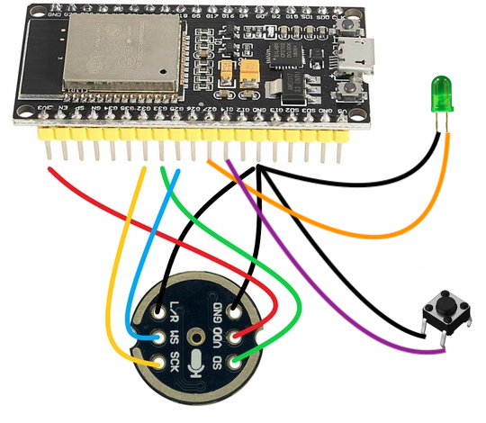
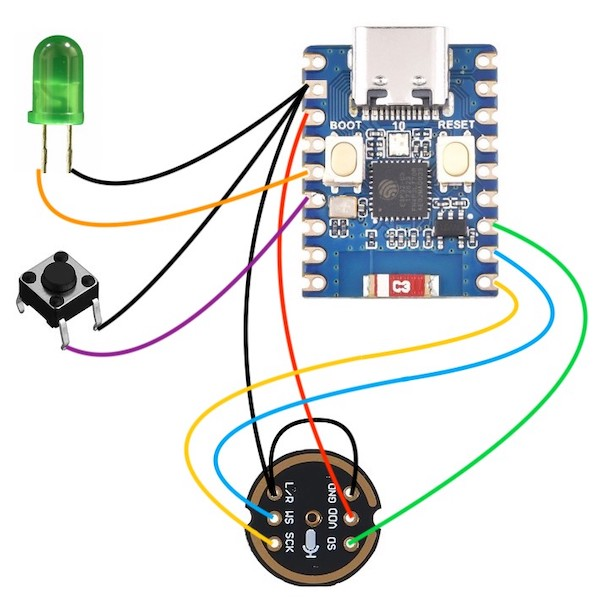

# SPEECH TO TEXT

This project demostrates how to setup and connect the INMP441 mic with ESP32 for speech-to-text using [Google's Speech-to-Text API](https://cloud.google.com/speech-to-text) in Arduino IDE. When the push button is pressed the ESP32 starts recording the audio for a couple of seconds. The LED is ON while recording audio. The audio is encoded using 16-bit linear pulse-code modulation (PCM) encoding and sent to Google's server using a web socket with [WiFiClientSecure](https://github.com/espressif/arduino-esp32/tree/master/libraries/WiFiClientSecure). The speech-to-text transciption is printted in the Serial Monitor.

## Google's Speech-to-Text API

Before jumping into coding get an API Key in order to use [Google's Speech-to-Text API](https://cloud.google.com/speech-to-text). To setup up an API Key follow [these steps](https://support.google.com/googleapi/answer/6158862). Replace your API Key in the Sketch:

```c++
const char* googleApiKey = "<YOUR_API_KEY>";
```

This project consumes the [speech:recognize API](https://cloud.google.com/speech-to-text/docs/reference/rest/v1/speech/recognize) as discribed in [Transcribe short audio files](https://cloud.google.com/speech-to-text/docs/sync-recognize) using the REST API.

As outline in [Best practices to provide data to the Speech-to-Text API](https://cloud.google.com/speech-to-text/docs/best-practices-provide-speech-data), the audio is sampled at a rate of `16,000 Hz` and it is encoded using `LINEAR16` 16-bit linear pulse-code modulation (PCM) encoding.

To learn for about encoding read [Introduction to audio encoding for Speech-to-Text ](https://cloud.google.com/speech-to-text/docs/encoding) and [WAVE PCM soundfile format](http://soundfile.sapp.org/doc/WaveFormat/).

## Recording time

I have tested this project using both ESP32 and ESP32-C3, and I have noticed than the ESP32 can record only up to around 3 seconds, and the ESP32-C3 can record longer times dispite the fact that the ESP32-C3 series has lower SRAM, ROM, and flash as shown in [Chip Series Comparison](https://docs.espressif.com/projects/esp-idf/en/v4.3/esp32c3/hw-reference/chip-series-comparison.html).

To record for about 3 second using [ESP32 Dev Board](../docs/ESP32-DevKitC_GSG_Ver1.4_2017.pdf) replace:

```c++
#define WAV_DATA_SIZE (160 * DIVIDED_WAV_DATA_SIZE)
```

To record for about 5 second using [ESP32-C3-Zero Dev Board](https://www.waveshare.com/esp32-c3-zero.htm) replace:

```c++
#define WAV_DATA_SIZE (190 * DIVIDED_WAV_DATA_SIZE)
```


## Wiring up

Modify the wiring as needed.

### ESP32

<div align="center">

</div>

```c++
#define PIN_LED 27
#define PIN_PUSH_BUTTON 14

#define I2S_MIC_SCK 32
#define I2S_MIC_WS 25
#define I2S_MIC_SD 33
```

|INMP441 | ESP32| Info|
|---|---|---|
|VDD|3v3|Power - DO NOT USE 5V!|
|GND|GND| GND|
|L/R|GND|Left channel or right channel|
|WS|25|Left right clock|
|SCK|32|Serial clock|
|SD|33|Serial data|

### ESP32-C3-Mini

<div align="center">

</div>

```c++
#define PIN_LED 1
#define PIN_PUSH_BUTTON 2

#define I2S_MIC_SCK 6
#define I2S_MIC_WS 7
#define I2S_MIC_SD 8
```

|INMP441 | ESP32-C3-Mini| Info|
|---|---|---|
|VDD|3v3|Power - DO NOT USE 5V!|
|GND|GND| GND|
|L/R|GND|Left channel or right channel|
|WS|7|Left right clock|
|SCK|6|Serial clock|
|SD|8|Serial data|

## References

- [I2S - API Reference](https://docs.espressif.com/projects/esp-idf/en/v3.3.5/api-reference/peripherals/i2s.html)
- [Sound with ESP32 – I2S Protocol](https://dronebotworkshop.com/esp32-i2s/)
- [The Simplest Test Code for an I2S Microphone on the ESP32 I can Imagine](https://github.com/atomic14/esp32-i2s-mic-test/tree/main)
- [ESP32-C3 Mini Development Board by Waveshare](https://www.waveshare.com/esp32-c3-zero.htm)
- [ESP32-C3-Zero Wiki by Waveshare](https://www.waveshare.com/wiki/ESP32-C3-Zero)
- [ESP32 Chip Series Comparison](https://docs.espressif.com/projects/esp-idf/en/v4.3/esp32c3/hw-reference/chip-series-comparison.html)
