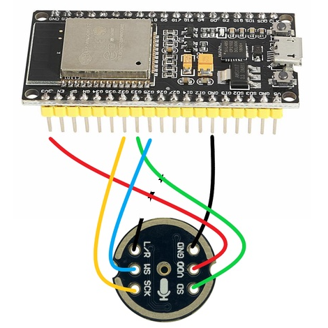

# I2S MIC SETUP

This project demostrates how to setup and connect the INMP441 mic with ESP32 and output the mic input in the serial ploter in Arduino IDE.

## Wiring up the INMP441

<div align="center">

</div>

Modify as needed:

```c++
#define I2S_MIC_SCK 32
#define I2S_MIC_WS 25
#define I2S_MIC_SD 33
```

|INMP441 | ESP32| Info|
|---|---|---|
|VDD|3v3|Power - DO NOT USE 5V!|
|GND|---| DO NOT CONNECT|
|L/R|GND|Left channel or right channel|
|WS|25|Left right clock|
|SCK|32|Serial clock|
|SD|33|Serial data|

## References

- [I2S - API Reference](https://docs.espressif.com/projects/esp-idf/en/v3.3.5/api-reference/peripherals/i2s.html)
- [The Simplest Test Code for an I2S Microphone on the ESP32 I can Imagine](https://github.com/atomic14/esp32-i2s-mic-test/tree/main)
